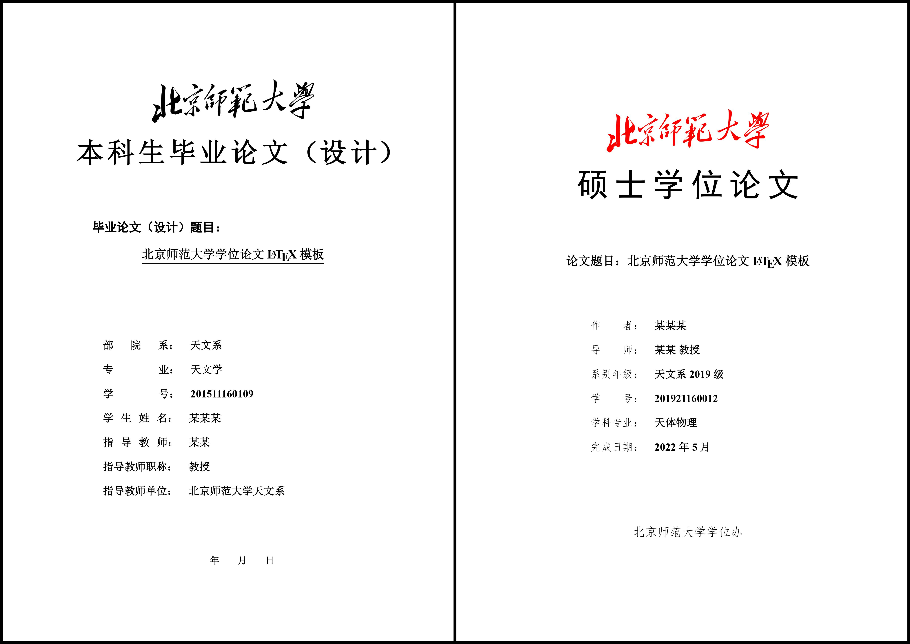

# BNU Thesis Template



**Template format has been approved by the university library.**

Beijing Normal University thesis template, suitable for undergraduate thesis (design), master's thesis, and doctoral thesis. This template is based on the [BNU Thesis LaTeX Template](http://gerry.lamost.org/blog/?p=811) and modified from the GitHub project [BNUBachelorThesis](https://github.com/xysmlx/BNUBachelorThesis).

## Recent Updates (Latest Features)

### 🆕 New Features Added
- **Custom Footnote Citations**: Enhanced `\footcite` command that displays full bibliographic information in footnotes
- **Automated Compilation Script**: `run.bat` for Windows users to automate the full compilation process
- **Missing Reference Checker**: Python script to identify missing citation keys in bibliography
- **Continuous Footnote Numbering**: Fixed footnote numbering to be continuous across the document
- **Vietnamese Language Support**: Added support for Vietnamese text with proper font handling

### 🔧 Technical Improvements
- **Bibliography Integration**: Full integration with `refs.bib` for comprehensive citation management
- **Compilation Automation**: One-click compilation with automatic PDF opening
- **Error Detection**: Tools to identify and fix missing bibliography entries
- **Cross-Platform Support**: Enhanced compatibility across different operating systems

## Recent Updates (Latest Features)

### 🆕 New Features Added
- **Custom Footnote Citations**: Enhanced `\footcite` command that displays full bibliographic information in footnotes
- **Automated Compilation Script**: `run.bat` for Windows users to automate the full compilation process
- **Missing Reference Checker**: Python script to identify missing citation keys in bibliography
- **Continuous Footnote Numbering**: Fixed footnote numbering to be continuous across the document
- **Vietnamese Language Support**: Added support for Vietnamese text with proper font handling

### 🔧 Technical Improvements
- **Bibliography Integration**: Full integration with `refs.bib` for comprehensive citation management
- **Compilation Automation**: One-click compilation with automatic PDF opening
- **Error Detection**: Tools to identify and fix missing bibliography entries
- **Cross-Platform Support**: Enhanced compatibility across different operating systems

## Project Ownership and Usage

### Disclaimer
This project is a personal fork and modification of the original BNU thesis template. The original template was created by the BNU community and is available under appropriate licenses. This version has been modified for personal use and educational purposes.

### Original Authors and Credits
- **Original BNU Template**: Created by Gerry and the BNU community
- **BNUBachelorThesis**: Modified by xysmlx and contributors
- **This Fork**: Personal modifications and improvements

### License and Usage
- This template follows the original license terms of the BNU thesis template
- You are free to use, modify, and distribute this template for academic purposes
- Please respect the original authors' work and maintain appropriate attribution
- For commercial use, please check the original license terms

### Personal GitHub Repository
This project is maintained as a personal GitHub repository for:
- Personal thesis writing and research
- Educational purposes and learning LaTeX
- Sharing improvements with the academic community
- Contributing back to the original project

**Note**: This is not an official BNU template repository. For official templates, please refer to the university's official channels.

### Academic Integrity and Personal Use

#### For Thesis Writing
- This template is designed for academic thesis writing
- Ensure your content follows academic integrity guidelines
- Use appropriate citations and references
- Follow your institution's thesis formatting requirements

#### Personal Development
- Use this template to learn LaTeX and academic writing
- Experiment with different formatting options
- Develop your own thesis writing workflow
- Share your learning experiences with others

#### Research and Collaboration
- Use for research paper writing and collaboration
- Adapt the template for different academic purposes
- Contribute improvements back to the community
- Maintain academic standards in all work

## Table of Contents

- [Quick Start](#quick-start)
- [Installation Guide for Beginners](#installation-guide-for-beginners)
- [VS Code Setup](#vs-code-setup)
- [Template Features](#template-features)
- [Compilation Instructions](#compilation-instructions)
- [Usage Guide](#usage-guide)
- [Troubleshooting](#troubleshooting)
- [Resources](#resources)

## Quick Start

### For Experienced LaTeX Users

1. **Clone the repository:**
   ```bash
   git clone https://github.com/your-repo/bnu-thesis-template.git
   cd bnu-thesis-template
   ```

2. **Compile with XeLaTeX:**
   ```bash
   xelatex main.tex
   bibtex main
   xelatex main.tex
   xelatex main.tex
   ```

3. **Open `main.pdf` to view the result**

### For Windows Users (Recommended)

1. **Use the automated script:**
   ```bash
   run.bat
   ```
   This will automatically:
   - Clean auxiliary files
   - Run the full compilation sequence
   - Open the PDF when complete

2. **Check for missing references:**
   ```bash
   python check_all_missing_refs.py
   ```

## Installation Guide for Beginners

### What is LaTeX?

LaTeX is a document preparation system used for technical and scientific documents. It's particularly popular in academia for writing papers, theses, and books because it handles complex formatting automatically.

### System Requirements

- **Windows**: Windows 10 or later
- **macOS**: macOS 10.14 or later  
- **Linux**: Ubuntu 18.04+ or equivalent
- **Memory**: At least 4GB RAM
- **Storage**: At least 5GB free space

### Step 1: Install TeX Live Distribution

#### Windows Installation

1. **Download TeX Live:**
   - Go to [TeX Live website](https://www.tug.org/texlive/)
   - Download the Windows installer
   - Choose "install-tl-windows.exe"

2. **Install TeX Live:**
   - Run the installer as Administrator
   - Choose "Install for all users" (recommended)
   - Select "Full" installation (about 4GB)
   - Click "Install" and wait (30-60 minutes)

3. **Add to PATH:**
   - Open System Properties → Advanced → Environment Variables
   - Add `C:\texlive\2023\bin\win32` to PATH
   - Restart your computer

#### macOS Installation

1. **Install MacTeX:**
   ```bash
   # Using Homebrew (recommended)
   brew install --cask mactex
   
   # Or download from https://www.tug.org/mactex/
   ```

2. **Verify installation:**
   ```bash
   xelatex --version
   ```

#### Linux Installation

```bash
# Ubuntu/Debian
sudo apt update
sudo apt install texlive-full texlive-xetex

# CentOS/RHEL
sudo yum install texlive-scheme-full
```

### Step 2: Install VS Code

1. **Download VS Code:**
   - Go to [code.visualstudio.com](https://code.visualstudio.com/)
   - Download for your operating system
   - Install with default settings

2. **Install LaTeX Workshop Extension:**
   - Open VS Code
   - Go to Extensions (Ctrl+Shift+X)
   - Search for "LaTeX Workshop"
   - Click Install

### Step 3: Install Chinese Fonts

#### Windows
Chinese fonts are usually pre-installed. If not:
1. Download SimSun, SimHei fonts
2. Install via Control Panel → Fonts

#### macOS
```bash
# Install Chinese fonts
brew install --cask font-source-han-sans
```

#### Linux
```bash
# Ubuntu/Debian
sudo apt install fonts-noto-cjk

# CentOS/RHEL  
sudo yum install google-noto-cjk-fonts
```

## VS Code Setup

### 1. Configure LaTeX Workshop

Create or edit `.vscode/settings.json` in your project:

```json
{
    "latex-workshop.latex.tools": [
        {
            "name": "xelatex",
            "command": "xelatex",
            "args": [
                "-synctex=1",
                "-interaction=nonstopmode",
                "-file-line-error",
                "%DOC%"
            ]
        },
        {
            "name": "bibtex",
            "command": "bibtex",
            "args": [
                "%DOCFILE%"
            ]
        }
    ],
    "latex-workshop.latex.recipes": [
        {
            "name": "xelatex -> bibtex -> xelatex*2",
            "tools": [
                "xelatex",
                "bibtex",
                "xelatex",
                "xelatex"
            ]
        }
    ],
    "latex-workshop.view.pdf.viewer": "tab",
    "latex-workshop.latex.autoClean.run": "onBuilt",
    "latex-workshop.latex.clean.fileTypes": [
        "*.aux",
        "*.bbl",
        "*.blg",
        "*.idx",
        "*.ind",
        "*.lof",
        "*.lot",
        "*.out",
        "*.toc",
        "*.acn",
        "*.acr",
        "*.alg",
        "*.glg",
        "*.glo",
        "*.gls",
        "*.ist",
        "*.fls",
        "*.log",
        "*.fdb_latexmk",
        "*.synctex.gz"
    ]
}
```

### 2. Recommended VS Code Extensions

Install these extensions for better LaTeX editing:

- **LaTeX Workshop** - Main LaTeX support
- **LaTeX Language Support** - Syntax highlighting
- **Word Count** - Count words in LaTeX documents
- **Chinese (Simplified) Language Pack** - Chinese interface
- **GitLens** - Git integration
- **Auto Rename Tag** - Helpful for LaTeX editing

### 3. Keyboard Shortcuts

| Action | Windows/Linux | macOS |
|--------|---------------|-------|
| Build LaTeX | Ctrl+Alt+B | Cmd+Alt+B |
| View PDF | Ctrl+Alt+V | Cmd+Alt+V |
| Clean auxiliary files | Ctrl+Alt+C | Cmd+Alt+C |

## Template Features

### Supported Degree Types

1. **Bachelor's Thesis** (`bachelor`)
   - Undergraduate thesis format
   - Black BNU logo
   - Simplified chapter numbering

2. **Master's Thesis** (`master`) 
   - Graduate thesis format
   - Red BNU logo
   - Full chapter numbering (第 X 章)

3. **Doctoral Thesis** (`doctor`)
   - PhD thesis format
   - Red BNU logo
   - Full chapter numbering
   - Additional requirements for book spine

### Key Features

- ✅ **Chinese Language Support** - Full UTF-8 encoding
- ✅ **Vietnamese Language Support** - Added font support for Vietnamese text
- ✅ **Multiple Fonts** - SimSun, SimHei, SimKai, SimLi, SimYou
- ✅ **Bibliography** - GB/T 7714-2015 standard
- ✅ **Professional Tables** - Booktabs formatting
- ✅ **Figure Support** - Automatic numbering and captions
- ✅ **Cross-references** - Automatic link generation
- ✅ **Mathematical Equations** - Full math support
- ✅ **Enhanced Footnotes** - Custom `\footcite` command with full bibliography info
- ✅ **Continuous Footnote Numbering** - Footnotes numbered continuously across document
- ✅ **Automated Compilation** - `run.bat` script for Windows users

## Compilation Instructions

### Method 1: Automated Script (Recommended for Windows)

1. **Use the provided script:**
   ```bash
   run.bat
   ```
   This will automatically:
   - Clean all auxiliary files
   - Run the full compilation sequence (xelatex → bibtex → xelatex → xelatex)
   - Open the PDF when complete

### Method 2: VS Code (Recommended for Beginners)

1. Open the project in VS Code
2. Open `main.tex`
3. Press `Ctrl+Alt+B` (Windows/Linux) or `Cmd+Alt+B` (macOS)
4. View the PDF by pressing `Ctrl+Alt+V`

### Method 3: Command Line

```bash
# First compilation
xelatex main.tex

# Generate bibliography
bibtex main

# Second compilation (resolve references)
xelatex main.tex

# Third compilation (final formatting)
xelatex main.tex
```

### Method 4: Overleaf (Online)

1. Go to [Overleaf](https://www.overleaf.com)
2. Create new project from template
3. Search for "BNU Thesis Template"
4. Upload your files or start from template

## Usage Guide

### 1. Modifying Thesis Information

Edit `data/cover.tex`:

```latex
\ctitle{Your Thesis Title}
\etitle{Your English Title}

\czuozhe{Your Name}
\cdaoshi{Your Supervisor}
\cxibienianji{Your Department and Year}
\cxuehao{Your Student ID}
\cxuekezhuanye{Your Major}
\cwanchengriqi{Completion Date}
```

### 2. Adding Chapters

1. Create new file in `data/` directory (e.g., `data/chap3.tex`)
2. Use this template:

```latex
% !Mode:: "TeX:UTF-8"

\chapter{Chapter Title}
\label{cha:chapter-label}

Your chapter content here.

\section{Section Title}
\label{sec:section-label}

Section content.

\subsection{Subsection Title}
\label{subsec:subsection-label}

Subsection content.
```

3. Add to `main.tex`:

```latex
\include{data/chap3}
```

### 3. Adding References

1. Add entries to `ref/refs.bib`:

```bibtex
@article{example2023,
  title={Example Article Title},
  author={Author Name},
  journal={Journal Name},
  year={2023},
  volume={1},
  number={1},
  pages={1--10}
}
```

2. Cite in your text:

```latex
% Regular citation
This is a reference \cite{example2023}.

% Footnote citation with full bibliography info
This is a footnote citation \footcite{example2023}.

% Footnote citation with additional text
This is a footnote citation \footcitewith{example2023}{See also}.
```

### 4. Adding Figures

1. Place images in `figures/` directory
2. Use in your document:

```latex
\begin{figure}[htb]
    \centering
    \includegraphics[width=0.8\textwidth]{figures/your-image.png}
    \caption{Figure caption}
    \label{fig:figure-label}
\end{figure}
```

### 5. Adding Tables

```latex
\begin{table}[htb]
    \centering
    \caption{Table caption}
    \label{tab:table-label}
    \begin{tabular}{|l|c|r|}
        \hline
        Left & Center & Right \\
        \hline
        Data & Data & Data \\
        \hline
    \end{tabular}
\end{table}
```

### 6. Checking for Missing References

Use the provided Python script to check for missing citation keys:

```bash
python check_all_missing_refs.py
```

This will:
- Scan all `.tex` files in your project
- Compare with your `refs.bib` file
- List any missing citation keys
- Help you identify empty bibliography entries

## Troubleshooting

### Common Issues

#### 1. "XeLaTeX not found" Error
**Solution:** Install TeX Live or ensure it's in your PATH

#### 2. Chinese Characters Not Displaying
**Solution:** 
- Ensure using XeLaTeX engine
- Check font installation
- Verify UTF-8 encoding

#### 3. Bibliography Not Generating
**Solution:**
- Run `bibtex main` after first compilation
- Check `.bib` file syntax
- Ensure `\bibliography{ref/refs}` in main.tex

#### 4. Font Errors
**Solution:**
- Copy fonts from `fonts/` to system font directory
- Or install Chinese fonts system-wide

#### 5. Compilation Takes Too Long
**Solution:**
- Use `\include` instead of `\input` for large files
- Optimize image sizes
- Remove unused packages

#### 6. Empty Bibliography Entries
**Solution:**
- Run `python check_all_missing_refs.py` to identify missing keys
- Add missing entries to `refs.bib`
- Or correct citation keys in your `.tex` files

#### 7. Footnote Numbering Issues
**Solution:**
- The template now supports continuous footnote numbering
- If you see per-page numbering, ensure you're using the latest version
- Check that `\footcite` commands are properly formatted

### Getting Help

1. **Check the logs:** Look at `.log` files for error details
2. **Search online:** Use error messages to find solutions
3. **Ask the community:** Post on LaTeX forums or GitHub issues
4. **Read documentation:** Check LaTeX and template documentation

## GitHub Setup and Contribution

### Setting Up Your Personal Repository

1. **Fork or Clone the Repository:**
   ```bash
   # Clone to your local machine
   git clone https://github.com/your-username/bnu-thesis-template.git
   cd bnu-thesis-template
   
   # Or fork the original repository and clone your fork
   ```

2. **Create a New Branch for Your Work:**
   ```bash
   git checkout -b feature/your-improvement
   ```

3. **Make Your Changes:**
   - Edit files as needed
   - Test compilation
   - Update documentation

4. **Commit and Push:**
   ```bash
   git add .
   git commit -m "Add your improvement description"
   git push origin feature/your-improvement
   ```

### Contributing Guidelines

#### For Personal Use
- Feel free to modify the template for your thesis
- Keep track of your changes in a separate branch
- Document any major modifications

#### For Community Contributions
- Fork the repository
- Create a feature branch
- Make your improvements
- Submit a pull request with clear description
- Ensure all tests pass (compilation works)

#### Code of Conduct
- Respect the original authors' work
- Provide clear documentation for changes
- Test thoroughly before submitting
- Be helpful and constructive in discussions

## Resources

### Learning LaTeX

- **[LaTeX Tutorial](https://www.latex-tutorial.com/)** - Beginner-friendly tutorial
- **[Overleaf Documentation](https://www.overleaf.com/learn)** - Comprehensive guides
- **[BNU Astronomy Department Resources](http://202.112.85.96/wiki/doku.php/latex;resources)** - LaTeX resources

### Template Resources

- **[Overleaf Template](https://www.overleaf.com/latex/templates/bnu-bachelor-slash-master-slash-phd-thesis-template/nhvczzkqtrqq)** - Online version
- **[GB/T 7714-2015 Standard](https://std.samr.gov.cn/gb/search/gbDetailed?id=71F772D7F969D3A7E05397BE0A0AB82A)** - Bibliography standard

### Community Support

- **LaTeX Stack Exchange** - Q&A community
- **CTAN** - Comprehensive TeX Archive Network
- **TeX Users Group** - Professional organization

---

## Todo List

- [x] Add custom `\footcite` command for full bibliography in footnotes
- [x] Create automated compilation script (`run.bat`)
- [x] Add Python script for checking missing references
- [x] Fix continuous footnote numbering
- [x] Add Vietnamese language support
- [ ] Add doctoral thesis book spine support
- [ ] Implement enhanced bibliography features  
- [ ] Create department-specific templates
- [ ] Improve Overleaf compatibility
- [ ] Add more example content
- [ ] Create video tutorials

---

*Template version: 1.53*  
*Last updated: 2024*  
*Compatible with: TeX Live 2021/2022, XeLaTeX*
